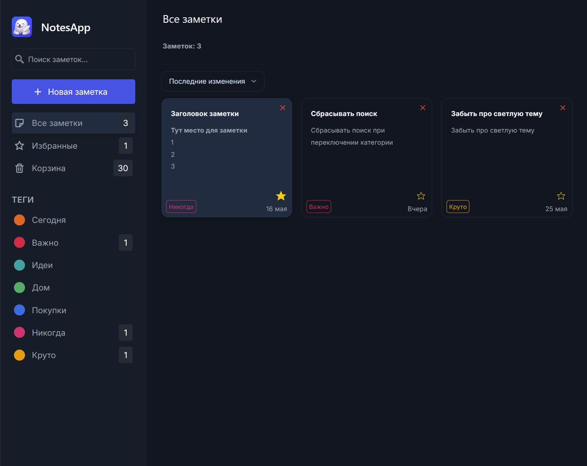
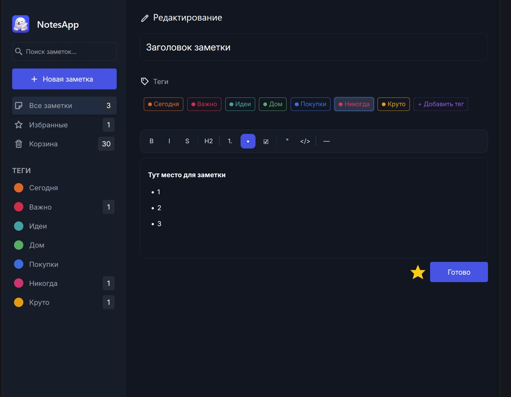
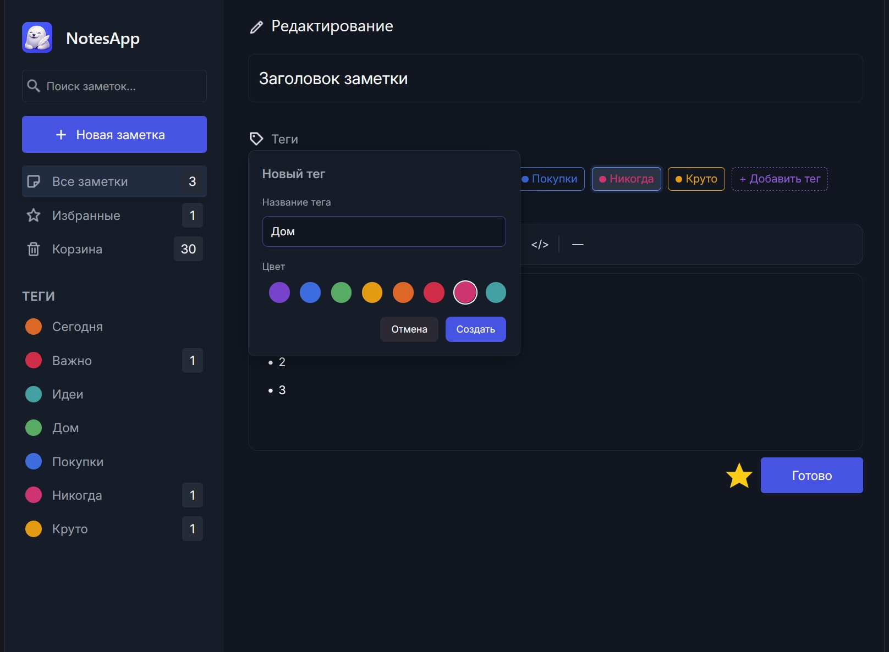

# Notes App

Небольшое React-приложение для создания и управления заметками.

## Функционал

- Создание и редактирование заметок
- Поиск с Debounce
- Избранное
- Корзина
- Теги
- Сортировка
- Возможность форматирования текста(Tiptap)
- Сохранение в LocalStorage

## Стек

- React
- Vite
- JavaScript
- CSS
- Tiptap

## Скриншоты

### Главный экран



### Редактор



### Теги



## Запуск проекта

```bash
git clone https://github.com/vadimk321/Notes-App.git

npm install
npm run dev
```
